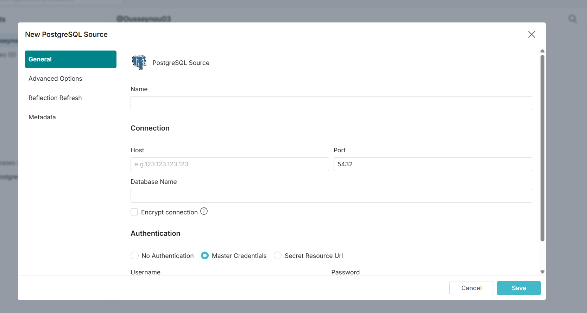

# 🧱 Data Platform — Médaillon Architecture (Bronze / Silver / Gold)

### 🚀 Réalisé par : **Ousseynou Dione**  
**Rôle :** Consultant Data Engineer / DataOps  
**Objectif :** Mettre en place une architecture de traitement et virtualisation des données, inspirée des meilleures pratiques Data Engineering.

---

## 📘 Description du projet

Ce projet met en œuvre une **architecture en médaillon (Bronze, Silver, Gold)** en utilisant :
- **PostgreSQL** comme Data Warehouse,
- **dbt** pour la modélisation et les transformations SQL,
- **Dremio** pour la virtualisation et l’accès aux données analytiques.

L’objectif est de simuler un flux complet de données, depuis leur ingestion brute jusqu’à leur exposition à des outils BI, en suivant une approche **moderne, modulaire et scalable**.

---

## 🏗️ Architecture technique


> 💡 *Les couches sont conçues pour séparer clairement les étapes d’ingestion, de transformation et d’exposition, facilitant la gouvernance et la qualité des données.*

---

## 🧩 Détails des couches

| Couche | Description | Outil principal |
|---------|--------------|----------------|
| **Bronze** | Données brutes ingérées depuis les fichiers CSV. | Python + PostgreSQL |
| **Silver** | Données nettoyées et enrichies via dbt. | dbt |
| **Gold (silver_gold)** | Données analytiques modélisées sous forme de tables de dimension et de faits. | dbt |
| **Virtualisation** | Exposition des tables gold via Dremio pour la consommation BI. | Dremio |

---

## ⚙️ Étapes principales

### 1. Ingestion (Bronze)
- Chargement des CSV vers la couche `bronze` dans PostgreSQL via le script :
  ```bash
  python ingest_to_bronze.py

**Tables créées :**

- bronze.customers

- bronze.orders

- bronze.products

### 2. Transformation (Silver & Gold)

Création du projet dbt : retail_dwh

Exécution des modèles :

- dbt run


Modèles principaux :

**Silver :**

- silver_customers

- silver_orders

- silver_products

**Gold :**

- dim_customers

- dim_products

- dim_date

- fact_orders

### 3. Virtualisation (Dremio)

**Connexion de PostgreSQL à Dremio via JDBC :**

- Host: IP Host local
- Port: 5434
- Database: postgres
- User: postgres
- Password: postgres


Création d’un espace virtuel Retail Analytics pour les vues et jointures.

Test des requêtes BI directement depuis Dremio.

## Résultat final

Tables disponibles dans la couche silver_gold :

Table	Type	Description
dim_customers	Dimension	Informations clients
dim_products	Dimension	Catalogue produits
dim_date	Dimension	Calendrier temporel
fact_orders	Fait	Mesures de vente

Exemple de résultat :

SELECT * FROM silver_gold.fact_orders LIMIT 5;

🧰 Stack technique
Composant	Version / outil
PostgreSQL	15
dbt-core	1.x
Python	3.10+
Pandas	Latest
Dremio	OSS (Docker)
Docker Compose	1.29+
📸 Exemples visuels (à ajouter)

✅ Connexion Dremio ↔ PostgreSQL


✅ Exploration des tables gold


On peut voir que la couche gold a bien été vrtualisé 

## 🗂️ Structure du projet

Voici l’arborescence complète du projet `learn_dbt`, présentant les différents modules et leur rôle dans l’architecture en médaillon :
````
learn_dbt/
│
├── 📁 data/ # Données sources (CSV simulées pour la couche Bronze)
│ ├── customers.csv
│ ├── orders.csv
│ └── products.csv
│
├── 📁 retail_dwh/ # Projet dbt (transformations Silver + Gold)
│ │
│ ├── 📁 models/ # Dossier des modèles dbt
│ │ ├── 📁 bronze/ # Tables brutes importées depuis PostgreSQL
│ │ ├── 📁 silver/ # Données nettoyées et normalisées
│ │ └── 📁 silver_gold/ # Modèles analytiques : dimensions et faits
│ │
│ ├── ⚙️ dbt_project.yml # Configuration du projet dbt
│ └── ⚙️ profiles.yml # Configuration de la connexion à la base (optionnel)
│
├── 📁 dremio/ # Fichiers et captures Dremio (virtualisation)
│ ├── 🖼️ dremio_connection.png # Connexion Dremio ↔ PostgreSQL
│ ├── 🖼️ dremio_virtualization.png # Espace virtuel & vues
│ └── 🖼️ dremio_dashboard.png # Exemple de dashboard BI
│
├── 🐍 ingest_to_bronze.py # Script Python pour charger les CSV dans la base (Bronze)
│
├── 📄 requirements.txt # Liste des librairies Python nécessaires
│
├── 🐳 docker-compose.yml # (Optionnel) Stack Docker : PostgreSQL + Dremio
│
└── 📘 README.md # Documentation principale du projet
``````

